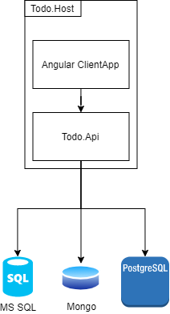

# Net Todo
Simple web based task management cross-platform application based on .NET and Angular. 

## High level design 

## Prerequisites
* .Net Core 3.1
* Docker
 
## Tech Stack
 * [ASP.NET Core](https://docs.microsoft.com/en-us/aspnet/core/)
 * [Tye](https://github.com/dotnet/tye)
 * [NUnit](https://nunit.org/)
 * [MediatR](https://github.com/jbogard/MediatR)
 * [AutoMapper](https://automapper.org/)
 * [Docker](https://www.docker.com/)

## Principles:
 * SOLID
 * Clean Arhitecture
 * CQRS
 * Feature Folders
 * TDD

# License
Net Todo is open source software, licensed under the terms of MIT license. 
See [LICENSE](LICENSE) for details.